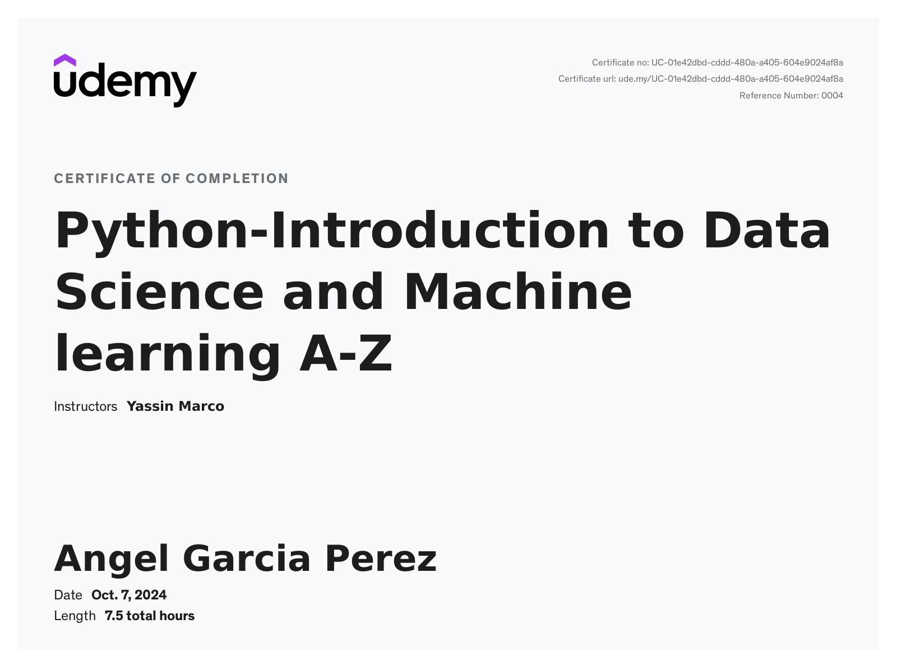
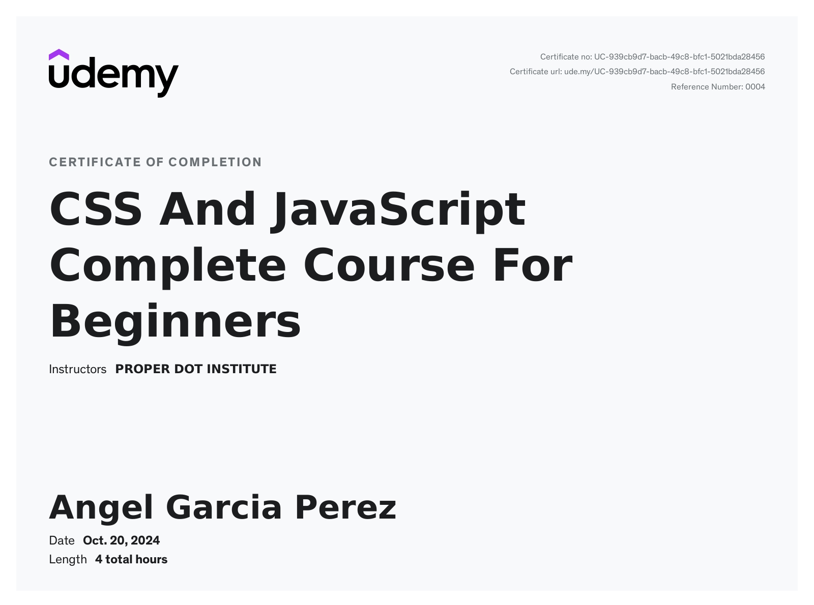

# Certificates from Udemy

## ABAP Certificate

## DevOps Certificate

## JavaScript Beginners Certificate

## JavaScript Moderno Certificate

## React Certificate

## React + Sockets

## Python Total

## Data Science and Machine Learning A-Z

## CSS and JavaScript for Beginners
